<div align="center">
  

  # Atlas Mailer

  [](https://workers.cloudflare.com/)
  [](https://hono.dev/)
  [](https://www.typescriptlang.org/)
  [](https://opensource.org/licenses/MIT)

  **A lightweight, edge-native microservice for async transactional emails.**
</div>

A robust microservice for dispatching transactional emails via Gmail SMTP. Built with Hono and deployed on Cloudflare Workers, this service provides asynchronous email delivery via Cloudflare Queues, automatic retries with exponential backoff, webhooks, and status polling. 

## Features

- **Asynchronous Execution**: Emails are enqueued immediately (returning HTTP 202) for background processing using Cloudflare Queues.
- **Reliable Delivery**: Automatic retries with exponential backoff and a Dead-Letter Queue (DLQ) for failed messages.
- **Status Tracking**: Poll email delivery status via a dedicated endpoint, backed by Cloudflare KV.
- **Webhooks**: Optional callback URLs to receive immediate notifications upon delivery success or permanent failure.
- **Secure Authentication**: Bearer token-based API protection across all endpoints.
- **Rate Limiting**: Enforced 500 emails/day quota via Cloudflare KV.
- **OpenAPI / Swagger**: Auto-generated OpenAPI spec and Swagger UI for API exploration.

## Tech Stack & Versions

- **Runtime**: [Cloudflare Workers](https://workers.cloudflare.com/)
- **Framework**: [Hono](https://hono.dev/) v4.x
- **Validation & OpenAPI**: `@hono/zod-openapi` & `@hono/swagger-ui`
- **Infrastructure**: Cloudflare Queues & KV
- **Testing**: Vitest + `@cloudflare/vitest-pool-workers`
- **Language**: TypeScript v5.x
- **Package Manager**: pnpm

## Project Structure

```text
atlas-mailer/
├── src/
│   ├── index.ts              # Application entry point & queue handler
│   ├── types.ts              # TypeScript interfaces and environment bindings
│   ├── lib/                  # Core business logic (mailer, consumers, KV, ratelimit)
│   └── routes/               # Hono route definitions (/send, /status, /health)
├── tests/                    # Vitest unit and integration test suite
├── .dev.vars                 # Local secrets (ignored by git)
├── package.json              # Project dependencies & scripts
├── vitest.config.ts          # Vitest configuration for Cloudflare Workers
└── wrangler.jsonc            # Cloudflare Workers configuration
```

## Architecture & Email Lifecycle

To understand the codebase, it's best to follow the journey of a single email request. We use an **asynchronous queueing model** to ensure fast API responses and reliable email delivery.

```mermaid
sequenceDiagram
    participant Client
    participant API as /send (Producer)
    participant KV as Cloudflare KV
    participant Queue as MAILER_QUEUE
    participant Consumer as Queue Consumer
    participant Gmail as Gmail SMTP

    Client->>API: POST /send (Auth, To, Subject...)
    
    rect rgb(30, 40, 50)
    Note over API, KV: 1. Pre-flight Checks
    API->>KV: Check Daily Rate Limit (< 500)
    end
    
    rect rgb(30, 40, 50)
    Note over API, Queue: 2. Enqueueing
    API->>API: Generate tracking ID (UUID)
    API->>KV: Write status: "queued"
    API->>Queue: Enqueue payload + ID
    API->>KV: Increment Rate Limit Counter
    API-->>Client: 202 Accepted (id: UUID)
    end

    rect rgb(30, 40, 50)
    Note over Consumer, Gmail: 3. Async Processing
    Queue-->>Consumer: Trigger on new message
    Consumer->>Gmail: Attempt SMTP Delivery
    alt Success
        Gmail-->>Consumer: Message ID
        Consumer->>KV: Update status: "sent"
        Consumer->>Queue: Ack message (Delete)
    else Failure
        Gmail--xConsumer: Connection Error
        Consumer->>KV: Update status: "retrying"
        Consumer->>Queue: Retry with exponential backoff
    end
    end
```



### Design Decisions

If you are modifying this codebase, please keep these architectural decisions in mind to avoid introducing bugs:

1. **The `nodejs_compat` Flag**: In `wrangler.jsonc`, you will see the `nodejs_compat` compatibility flag. **Do not remove this.** Cloudflare Workers do not natively support Node.js TCP sockets out of the box, which are required by `nodemailer` to talk to Gmail's SMTP servers. This flag enables a Cloudflare polyfill that allows `nodemailer` to function natively on the edge.
2. **Rate Limit Incrementing**: The rate limit counter is incremented in `routes/send.ts` (the producer), **not** in the consumer. The rate limit represents "Requests accepted per day," not "Emails successfully sent per day." Incrementing in the producer ensures a bad actor cannot flood the queue with 10,000 bad emails that constantly fail.
3. **Exponential Backoff & The DLQ**: When an email fails to send, we retry it using exponential backoff (15s, 30s, 60s, 2m, 4m). If the email fails 5 times, Cloudflare Queues automatically drops it from the main queue and routes it to `mailer-dlq` (Dead Letter Queue). `dlq.ts` picks it up, marks the KV status as `failed`, and stops trying. 
4. **Single Consumer Concurrency**: Our queue configuration aims to ensure we only have one Worker instance processing emails at a time, preventing us from accidentally triggering Gmail's anti-spam concurrency limits by firing simultaneous SMTP connections.

## API Specification

An interactive Swagger UI is available at `/docs` when the service is running. 

### POST `/send`

Enqueue an email for delivery.

#### Headers
```json
{
  "Authorization": "Bearer <API_KEY_SECRET>",
  "Content-Type": "application/json"
}
```

#### Request Body
```json
{
  "to": "recipient@example.com",
  "subject": "System Notification",
  "text": "Plain text content (optional if html provided)",
  "html": "<h1>HTML Content</h1> (optional if text provided)",
  "callbackUrl": "https://yourapp.com/webhooks/email-status"
}
```

#### Success Response (202 Accepted)
```json
{
  "success": true,
  "id": "123e4567-e89b-12d3-a456-426614174000",
  "status": "queued"
}
```

### GET `/status/:id`

Poll the delivery status of a previously enqueued email.

#### Headers
```json
{
  "Authorization": "Bearer <API_KEY_SECRET>"
}
```

#### Success Response (200 OK)
```json
{
  "success": true,
  "status": "sent",
  "messageId": "<smtp-id>",
  "sentAt": "2026-07-21T10:00:00.000Z"
}
```
*Note: `status` can be `queued`, `retrying`, `sent`, or `failed`.*

## Setup & Deployment

### Prerequisites
- Node.js (v18 or higher)
- `pnpm` installed globally
- A Gmail account with 2FA enabled and an [App Password](https://support.google.com/accounts/answer/185833)
- Cloudflare Account with Wrangler CLI authenticated

### Installation
1. Clone the repository.
2. Install dependencies:
   ```bash
   pnpm install
   ```
3. Configure environment variables:
   ```bash
   cp .dev.vars.example .dev.vars
   ```
   Update `.dev.vars` with your Gmail credentials and preferred API key.

### Local Development
Local development uses a local simulator for KV storage and Queues.
```bash
pnpm dev
```
You can access the Swagger UI at `http://localhost:8787/docs`.

### Testing
Run the complete test suite locally using Vitest and Miniflare.
```bash
pnpm test
```

### Deployment
1. Create a KV namespace:
   ```bash
   pnpm wrangler kv namespace create MAILER_KV
   ```
2. Update the `id` under `kv_namespaces` in `wrangler.jsonc` with the generated namespace ID.
3. Create the required Queues:
   ```bash
   pnpm wrangler queues create mailer-queue
   pnpm wrangler queues create mailer-dlq
   ```
4. Deploy to Cloudflare:
   ```bash
   pnpm run deploy
   ```
5. Set production secrets:
   ```bash
   pnpm wrangler secret put GMAIL_APP_PASSWORD
   pnpm wrangler secret put API_KEY_SECRET
   pnpm wrangler secret put GMAIL_USER
   ```

## License
MIT
